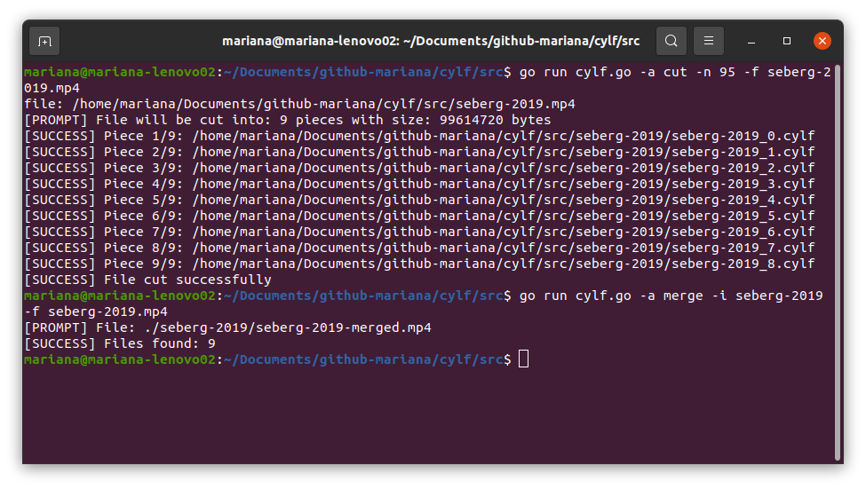

# `cylf`

**`cylf`** will cut your files into binary chunks that can be re-merged together using only the name of the original file. 

> This comes in handy when a hosting service has file size limit in the files you upload: with cylf you cut them following the size limit so that upload is allowed, and then in any desired machine you dowload those pieces and merge them using cylf again!

## Usage

1. Download the binary you need.

2. In the same folder you got the binary, store the needed input files/folders.

# Run The Executables

- Inside `bin/` folder, you will find the folders that hold the two executables (cutter + merger) of the program. Currently **`cylf`** is available for:

    - Linux Ubuntu

    - Windows 10

## Linux

Open a terminal, go to the directory where the two executables and all the input files are located correctly, and type:

```
./cylf -a cut -n 95 -f <FILE_NAME.EXT>
```

or 

```
./cylf -a merge -i <FOLDER_NAME_WITH_PARTS> -f <OUT_FILE_NAME.EXT>
```

depending on the action you want to do. Notice that `<FOLDER_NAME_WITH_PARTS>` is just the name of the folder, not the path.

*Note: if you run `sudo chmod 777 cylf` before any of the two commands above, you can replace `./cylf` with `cylf` inside such commands. Also, if you want the output written to a file, add at the end of the command: ` > output.txt`.

## Windows 10

Open a terminal, go to the directory where the two executables and all the input files are located correctly, and type:

```
start cylf.exe -a cut -n 95 -f <FILE_NAME.EXT>
```

or 

```
start cylf.exe -a merge -i <FOLDER_WITH_PARTS> -f <OUT_FILE_NAME.EXT>
```

depending on the action you want to do.

# Run The Source Code

- Go Version: `go1.18.3 linux/amd64`

Open a terminal inside `./src/`folder and type: 

```
export GO111MODULE=off
```

in order to avoid error messages such as *package XXX is not in GOROOT* or similar.

Then, type:

```
go run cylf.go -a cut -n 95 -f <FILE_NAME.EXT>
```

or

```
go run cylf.go -a merge -i <FOLDER_NAME_WITH_PARTS> -f <OUT_FILE_NAME.EXT>
```

depending on the action you want to do



### To Cross Compile The Source Code

- Windows 10

```
GOOS=windows GOARCH=amd64 go build cylf.go
```

- Raspberry Pi 3 Model B

```
GOOS=linux GOARCH=arm go build cylf.go
```