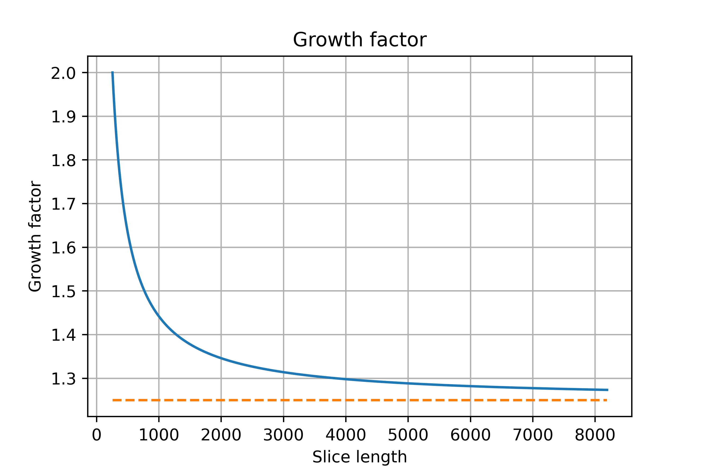

# Memory Analysis With Golang's `growslice`

## The `make` function

It allocates a new array and creates a slice header to describe it, all at once. The make function takes three arguments: the type of the slice, its initial length, and its capacity, which is the length of the array that make allocates to hold the slice data. This call creates a slice of length 10 with room for 5 more (15-10), as you can see by running it:

```go
slice := make([]int, 10, 15)
fmt.Printf("len: %d, cap: %d\n", len(slice), cap(slice))
```

The length argument defaults to the capacity, so you can leave it out to set them both to the same value. After

```go
gophers := make([]Gopher, 10)
```

the gophers slice has both its length and capacity set to 10.

### The `glowslice` method

The implementation in golang's source files reads:

```go
newcap := oldCap
doublecap := newcap + newcap
if newLen > doublecap {
    newcap = newLen
} else {
    const threshold = 256
    if oldCap < threshold {
        newcap = doublecap
    } else {
        // Check 0 < newcap to detect overflow
        // and prevent an infinite loop.
        for 0 < newcap && newcap < newLen {
            // Transition from growing 2x for small slices
            // to growing 1.25x for large slices. This formula
            // gives a smooth-ish transition between the two.
            newcap += (newcap + 3*threshold) / 4
        }
        // Set newcap to the requested cap when
        // the newcap calculation overflowed.
        if newcap <= 0 {
            newcap = newLen
        }
    }
}
```

Which means that, if we have a slice with $N$ elements (length) and capacity $C$:

- It will store a possible double length as $2C$.
- If you want to append $X$ elements to $N$ and $X+N$ > $2C$, then the capacity will be $X+N$.
- Otherwise, if $C$ < 256, then the capacity is set to $2C$.
- If $C$ >= 256 (meaning we deal with big slices), the algorithm grows the new capacity, $C'$ in a loop: while $C'$ < $X+N$ (meaning the capacity still cannot hold the new values), $C'$ will grow as follows:

$$
C' += \frac{(C' + 3\times256)}{4}
$$

which is intended to make a 'smooth' transition between the 2x growth for small slices to 1.25x growth for big slices. This smooth transition can be seen in the picture below, where the starting point is a capacity of 256, for which the equation above would compute:

$$
C' = C' + \frac{(C' + 3\times256)}{4} = 256 + \frac{256}{4} + \frac{3(256)}{4} = 256 + \frac{4(256)}{4} = 256 + 256
$$

which is a growth factor of 2.0, considering the initial capacity of 256 and the new capacity as 512. For a large capacity, say 8192, the computation looks as:

$$
C' = C' + \frac{(C' + 3\times256)}{4} = 8192 + \frac{8192}{4} + \frac{3(256)}{4} = 8192 + 2240,
$$

meaning we got a total new capacity of 10432, for which the initial capacity was 8192, the growth factor (10432 / 8192) is 1.2734375. Thus, below the plot shows the factor for each initial capacity, starting from the aforementioned 256 and ending in 8192.



Once the algorithm gets the final new capacity $C'$, a new, larger array is allocated with this capacity, the old one is copied using `copy()` and you are handed a slice pointing to the larger copy. The `copy()` function works as follows for an original slice called `t`:

```go
for i := range s {
    t[i] = s[i]
}
s = t
```

To increase the capacity of a slice one must create a new, larger slice and copy the contents of the original slice into it. We append elements to the end of a slice following the logic:

```go
func AppendByte(slice []byte, data ...byte) []byte {
    m := len(slice)
    n := m + len(data)
    // if we need to reallocate a bigger array:
    if n > cap(slice) { // if necessary, reallocate
        // allocate with C' as capacity
        newSlice := make([]byte, C_prime)
        // copy the slice elements to the new bigger one
        copy(newSlice, slice)
        slice = newSlice
    }
    slice = slice[0:n]
    // finally, append the new data
    copy(slice[m:n], data)
    return slice
}
```

## Handy Links

- https://stackoverflow.com/questions/25212260/out-growing-slice-and-underlying-array
- https://codeburst.io/a-comprehensive-guide-to-slices-in-golang-bacebfe46669
- https://go.dev/blog/slices-intro
- https://go.dev/blog/slices
- https://github.com/golang/go/blob/master/src/runtime/slice.go